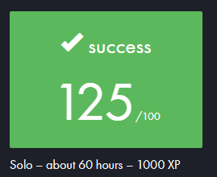

# 🎮 so_long

**Projet 42 – Création d'un jeu 2D avec la bibliothèque MLX42**

Ce projet consiste à développer un jeu vidéo en 2D en utilisant la bibliothèque graphique **MLX42**, une version moderne et améliorée de la MiniLibX, développée par Codam. ([github.com](https://github.com/codam-coding-college/MLX42?utm_source=chatgpt.com)) L'objectif est de créer un jeu interactif où le joueur navigue à travers une carte, collecte des objets et atteint un point de sortie, tout en respectant les contraintes de la norme 42.



---

## 🧩 Objectifs du projet

- **Création d'un jeu en 2D** : Développer un jeu avec une interface graphique simple.
- **Utilisation de MLX42** : Manipuler la bibliothèque MLX42 pour gérer les fenêtres, les images et les événements.
- **Gestion de la carte** : Lire et valider une carte depuis un fichier `.ber`.
- **Détection des collisions** : Implémenter la logique de déplacement et les interactions avec les éléments de la carte.
- **Comptage des mouvements** : Afficher le nombre de mouvements effectués par le joueur.
- **Bonus** : Ajouter des fonctionnalités supplémentaires comme des ennemis ou des animations.

---

## 🧱 Fonctionnalités

### Fonctionnalités de base

- **Déplacement du joueur** : Utilisation des touches `W`, `A`, `S`, `D` pour déplacer le joueur sur la carte.
- **Collecte d'objets** : Récupération d'objets (représentés par le caractère `C`) pour augmenter le score.
- **Point de sortie** : Atteindre le point de sortie (représenté par le caractère `E`) pour terminer le niveau.
- **Affichage des mouvements** : Le nombre de mouvements effectués est affiché dans le terminal.
- **Validation de la carte** : La carte doit être valide, avec des murs (`1`), des espaces vides (`0`), des objets (`C`) et un point de sortie (`E`).

### Fonctionnalités bonus

- **Ennemis** : Ajout de patrouilles ennemies qui se déplacent sur la carte.
- **Animations** : Intégration de sprites animés pour le joueur et les ennemis.
- **Affichage des mouvements à l'écran** : Le nombre de mouvements est affiché directement dans la fenêtre du jeu.

---

## 🛠️ Installation et utilisation

### Prérequis

- **MLX42** : La bibliothèque graphique MLX42 doit être installée. Suivez les instructions spécifiques à votre système d'exploitation pour l'installation. ([github.com](https://github.com/codam-coding-college/MLX42?utm_source=chatgpt.com))

### Compilation

Clonez le repository et compilez le projet :

```bash
git clone https://github.com/Coschda/so_long.git
cd so_long
make
```